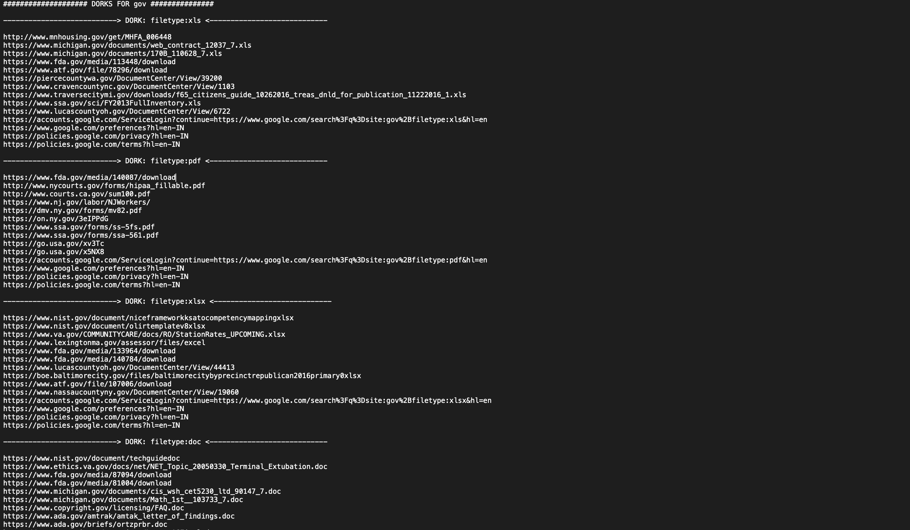

# Grawler 
Grawler is a tool written in PHP which comes with a web interface that automates the task of using google dorks, scrapes the results, and stores them in a file.

## Table of contents
* [General info](#general-info)
* [Features](#features)
* [Setup](#setup)
* [Demo](#demo)
* [Sample Result](#sample-result)
* [Captcha Issue](#Captcha-issue)
* [Solution](#Solution)
* [Contribute](#contribute)
* [Contact Me](#Contact-me)

## General info 
Grawler aims to automate the task of using google dorks with a web interface, the main idea is to provide a simple yet powerful tool which can be used by anyone, Grawler comes pre-loaded with the following features.
	
## Features
* Supports multiple search engines (Google, Yahoo, Bing)
* Comes with files containing dorks which are categorized in three categories as of now.
	* Filetypes
	* Login Pages
	* SQL Injections
	* My_dorks (This file is intentionally left blank for users to add their own list of dorks)
* Comes with its own guide to learn the art of google dorks.

* Built-in feature to use proxy (just in case google blocks you)

* Saves all the scraped URL's in a single file (name needs to be specified in the input field with extension .txt).
* Grawler can run in four different modes 
	* Automatic mode: Where the Grawler uses dorks present in a file and stores the result.
	* Automatic mode with proxy enabled
	* Manual mode: This mode is for users who only want to test a single dork against a domain.
	* Manual mode with proxy enabled 

## Setup
* Download the ZIP file
* Download XAMPP server
* Move the folder to htdocs folder in XAMPP
* Navigate to http://localhost/grawler 

## Demo
* [How to run Grawler?](https://youtu.be/17f82HCjEPQ)
* There are several ways to use proxy , i have personally used [Scrapeapi](https://www.googleadservices.com/pagead/aclk?sa=L&ai=CxFednC3cX__nFZKAyAOYypCQBv2hl45g5ayIi6YJ2_DCne4NCAAQASC5VCgCYOWa6YPgDqABhf3l_ALIAQHIA9ggqgRLT9AJZni2lVPYQ4BuUjGAlL0mdFFpk1LhyJLZV3e6MZ5e24eduMdgpzLrAfjsK5SkPiM-HZlWrCOvg0SoO03szjdiKxi-qmQxiHwqwAT919OSygGABZBOoAZRgAfjgpqDAYgHAZAHAagHpr4bqAfw2RuoB_LZG6gH89EbqAfu0huoB8rcG7AIAdIIBRACIIQBmgkbaHR0cHM6Ly93d3cuc2NyYXBlcmFwaS5jb20vsQkSxVcm5sQvbbkJEsVXJubEL234CQGYCwGqDAIIAbgMAYgUAw&ae=2&ved=2ahUKEwil6dW31tbtAhVmgtgFHSObAWIQ0Qx6BAgIEAE&dct=1&dblrd=1&sival=AF15MEA-raP21ZHDY_iwHCyJAfS_Qx5PfncSr8fDJLagF6iFE3veo3RLKzEWMeXgg_Go1snwcjfIexZCfbZvFtR128lUHZs01OEFIuLtNZeHWxucoaY2FoMdG1NYDtqF2P0HT4UWmx0Xx6MB7aW2v3Xr30wAvNjAMg&sig=AOD64_3BCrWb701eDmLA0IbNNW2bpWi95A&adurl=https://www.scraperapi.com/%3Futm_source%3Dgoogle%26utm_medium%3Dcpc%26utm_campaign%3Ds_branded%26utm_term%3Dscraperapi) because they give free API calls without any credit card information or anything, and you can even get more API calls for free.
	* [How to setup proxy in Grawler?](https://youtu.be/appnamqU2N4)
* [How to run Grawler in manual mode?](https://youtu.be/K8Ela10aYGw)

## Sample Result

## Captcha Issue
Sometimes google captcha can be an issue, because google rightfully detects the bot and tries to block it, there are ways that I've already tried to avoid captcha like :
* Using different user-agent headers and IP in a round-robin algorithm.
	* It works but it gives a lot of garbage URLs that are not of any use and in addition to that it's also slow, so I removed that feature.
* Using free proxy servers 
	* Free proxy servers are too slow and they often get blocked due to the fact that a lot of people use these free proxy servers for scraping.
* Sleep function
	* This works up to some extent so I have incorporated it in the code.
* Tor Network
	* Nope, doesn't work every time I tried it, a beautiful captcha was presented, so I removed this functionality too.
## Solution
* The best solution that I have found is to sign up for a proxy service and use it, it gives good results with less garbage URL's but it can be slow sometimes.
* Use a VPN.

## Contribute
* Report Bugs
* Add new features and functionalities 
* Add more effective google dorks (which actually works)
* Workaround the captcha issue
* Create a docker image(basically work on portability and usability)
* Suggestions

## Contact Me
You can contact me here [A3h1nt](https://twitter.com/A3h1nt) regarding anything.
