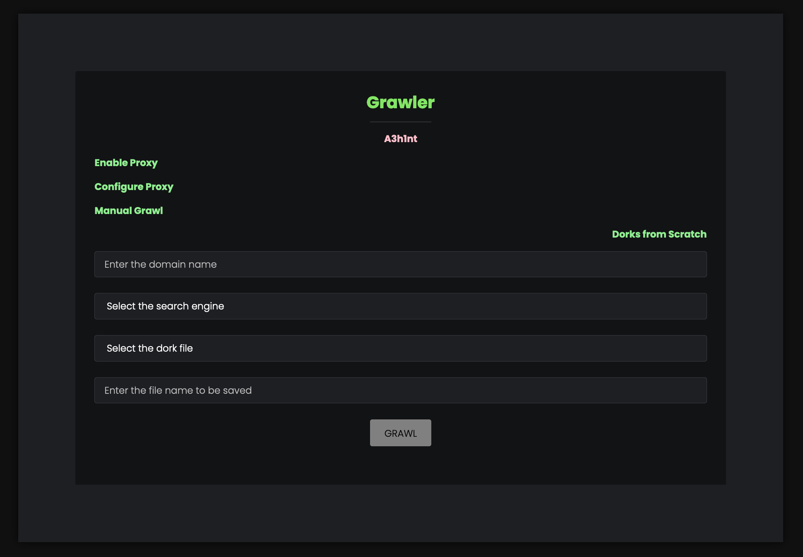
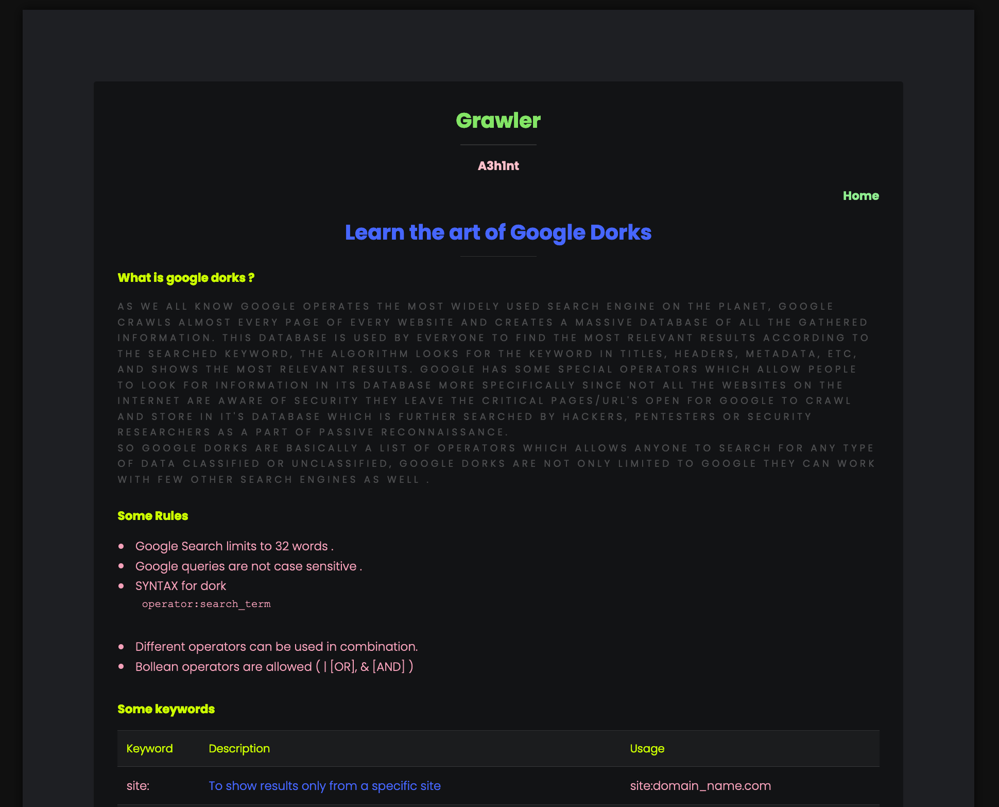
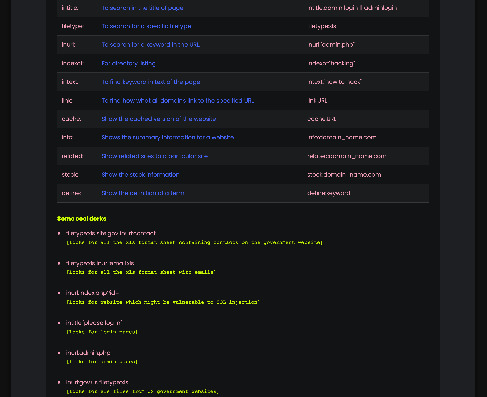
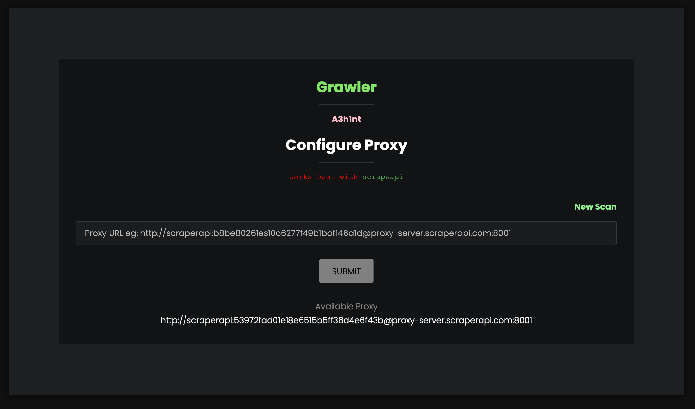

# Grawler
Grawler is a tool written in PHP which comes with a web interface that automates the task of using google dorks with many other functionalities.

## Table of contents
* [General info](#general-info)
* [Features](#features)
* [Setup](#setup)

## General info 
Grawler aims to automate the task of using google dorks with a web interface, the main idea is to provide simple yet powerful tool which can be used by anyone, GRAWLER comes pre-loaded with the following features.
	
## Features
* Supports multiple search engines (Google,Yahoo,Bing)
* Comes with files containing dorks which are categorized in three categories as of now.
	* Filetypes
	* Login Pages
	* SQL Injections
	* My_dorks (This file is intentionally left blank for users to add their own list of dorks)
* Comes with it's own guide to learn the art of google dorks.

* Built-in feature to use proxy (just incase google blocks you)

* Saves all the results in a single file (name needs to be specified in the input filed).
* Grawler can run in four different modes 
	* Automatic mode: Where the grawler uses dorks present in a file and stores the result.
	* Automatic mode with proxy enabled
	* Manual mode: This mode is for users who only wants to test a single dork against a domain.
	* Manual mode with proxy enabled 

## Setup
* Download the ZIP file
* Download XAMPP server
* Move the folder to htdocs folder in XAMPP
* Navigate to http://localhost/grawler 

## Demo
* [How to run Grawler ?](https://youtu.be/17f82HCjEPQ)
